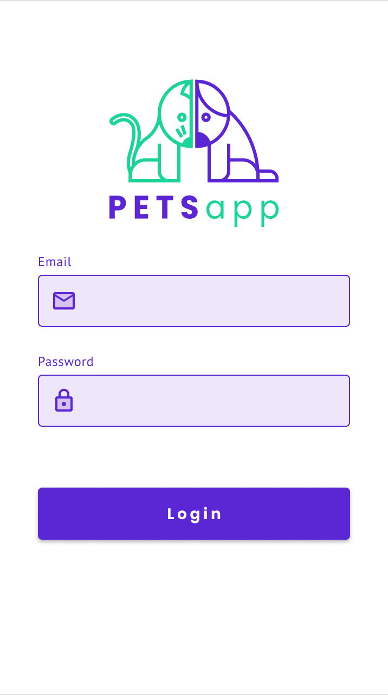
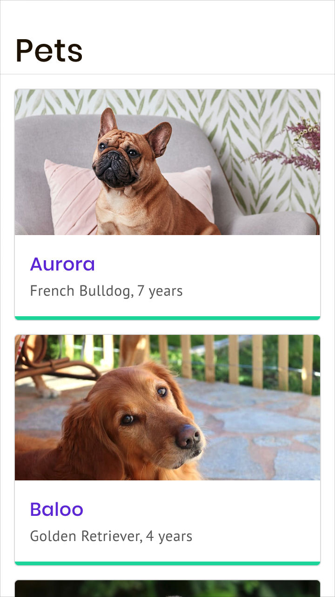
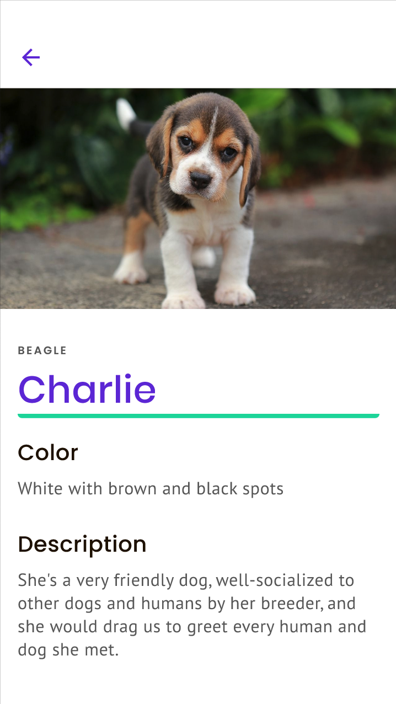

# Android 101

This PetsApp is a prototype for an Android 101 Workshop, based on the Mobile Practice Challenge of the Android Learning Path.

For this Android Application the design can found [here](https://www.figma.com/file/YhKiLE6rLGGVK6rCalLQqL/Pets-App-Android-101?node-id=0%3A1).

  

More Resources of the Mobile Learning Paths can be found on [here](https://github.com/gorillalogic/mobile-practice/tree/master/learning-paths).

## Prerequisites

```
* Android Studio 4.+
* +100 Positive Attitude 
```

## Built With

* [AndroidX](https://developer.android.com/jetpack/androidx) - AndroidX is the open-source project that the Android team uses to develop, test, package, version and release libraries within Jetpack.
* [Material Design](https://material.io/develop/android) - Material is an adaptable system of guidelines, components, and tools that support the best practices of user interface design. Backed by open-source code, Material streamlines collaboration between designers and developers, and helps teams quickly build beautiful products.
* [JetPack Navigation Component](https://developer.android.com/guide/navigation) - Android Jetpack's Navigation component helps you implement navigation, from simple button clicks to more complex patterns, such as app bars and the navigation drawer. The Navigation component also ensures a consistent and predictable user experience by adhering to an established set of principles.
* [Picasso](https://github.com/square/picasso) - A powerful image downloading and caching library for Android.
* [GSON](https://github.com/google/gson) - Gson is a Java library that can be used to convert Java Objects into their JSON representation. It can also be used to convert a JSON string to an equivalent Java object..

## Resources

### Android Toolbar

[Material Top App Bar](https://material.io/components/app-bars-top/android#regular-top-app-bar) - Basic Implementation of a Material Top App Bar as an example.

### Understanding Navigation

[Getting Started](https://developer.android.com/guide/navigation/navigation-getting-started) - As a quick intro to Jetpack's Navigation component here is a guide for a detailed implementation of the the Library.

### Image Loading

[Picasso](https://square.github.io/picasso/) General Documentation of the Image Loading Library by Square.


## Author

* **Kevin Villalobos**